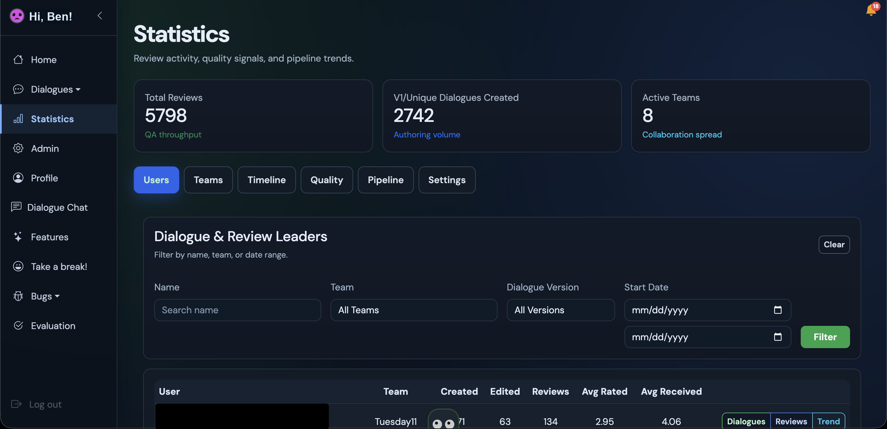
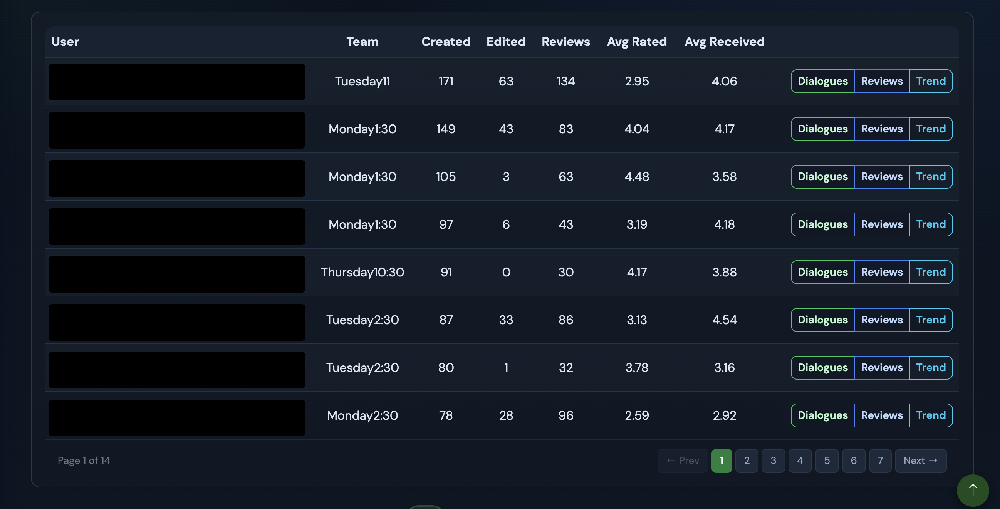
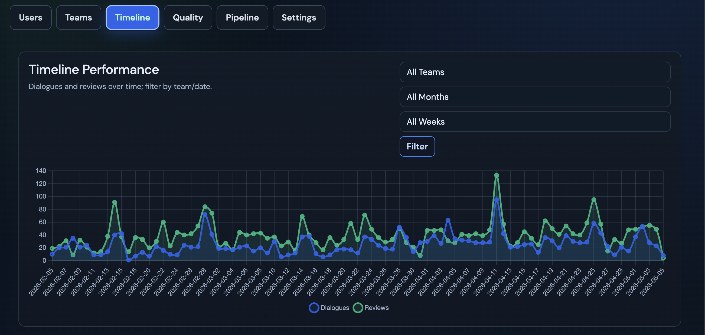
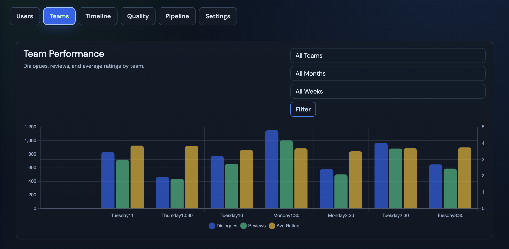
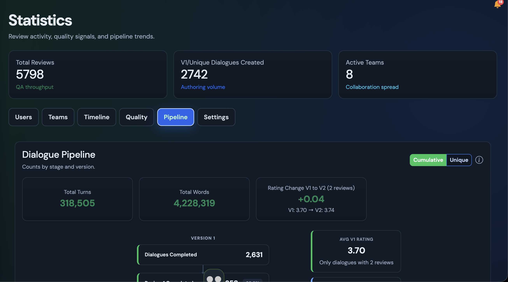
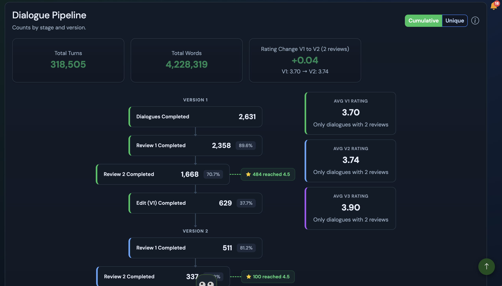
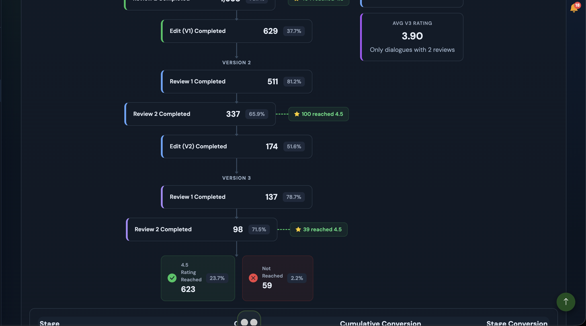
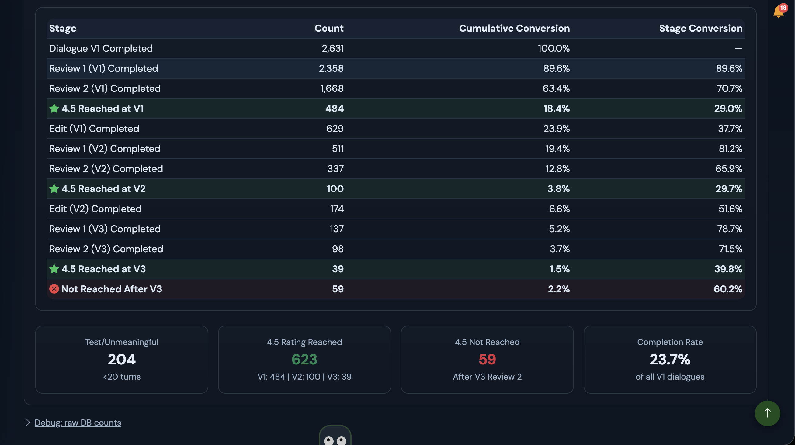
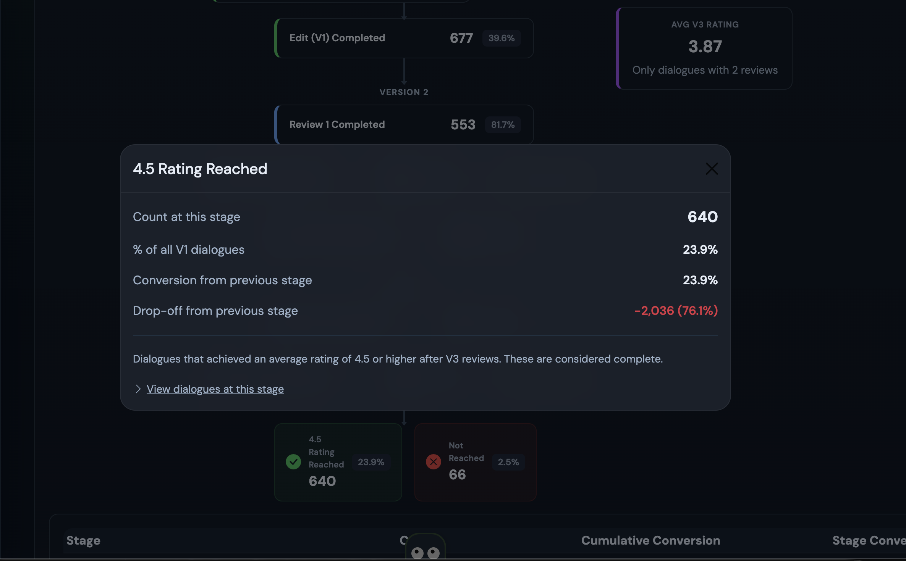
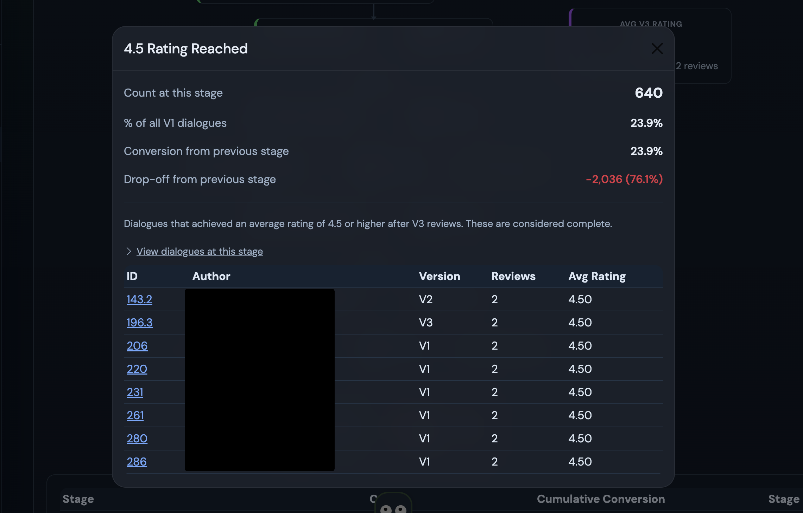

# Eversource Work (DALI App outside code sample)

## Eversource Statistics Dashboard

My code samples can be found in the `stats.py` and `stats_routes.py` files of this repo.

I was tasked with creating and expanding a user statistics page to help Evergreen research coordinators/project managers track student work and progress creating dialogue training data on Eversource, a fullstack Flask web app used to store LLM training data for the Evergreen generative chatbot model.

The main additions since my previous code sample are related to the Pipeline tab and flowchart. `stats.py` collects and calculates the statistics for each stage of the flowchart, while `stats_routes.py` handles the Flask routing logic and prepares the dashboard data for the template.

### Features:

1. User table that tracks:

- User, Team, Dialogues Created, Reviews Done, Average Rated Reviews, Average Rating Received
- Search/sort table by Name, Team, Version, or Start/End Date
- Paginated user results for larger teams
- Version-specific average rating filters for reviews given and ratings received

2. Graph Actions:

- View Team Performance, Timeline, Quality, and Pipeline graphs
- View weekly V1 rating trends and changes over time
- View dialogue pipeline flow across V1, V2, and V3 review/edit stages

3. Overview of Team Performance

- Team-level dialogue and review totals
- Average rating trends
- Dialogue quality and pipeline completion metrics

4. Pipeline Settings

- Admin-only settings for minimum turns, required reviews, and rating threshold
- Backend pipeline calculations for meaningful dialogues, review progress, edits, and rating outcomes

### Implementation:

- Frontend/UI implemented with Flask/Jinja template with Bootstrap layout (HTML, CSS, JavaScript) (as per structure of Eversource project).
- Route and dashboard context logic implemented in `stats_routes.py`
- Statistics calculations and dialogue pipeline helpers implemented in `stats.py`
- Chart.js library used for graph trends/bar charts
- SQLAlchemy queries used for user, team, reviewer, rating, and version statistics
- Flowchart consists of static HTML/CSS components and uses JS for clickable interactivity

### Key Functions:

- `admin_user_statistics()` in `stats_routes.py` builds the main dashboard page. It reads filters from the request, gets user/rating data, handles pagination, selects the active graph tab, and passes the final context into the template.
- `save_pipeline_settings()` in `stats_routes.py` lets admins update the minimum turns, required reviews, and rating threshold used by the pipeline.
- `compute_dialogue_pipeline()` in `stats.py` is the main pipeline algorithm. It groups dialogues by family/version, filters out test or unmeaningful dialogues, tracks progress through V1, V2, and V3 stages, and returns both cumulative and unique counts for the flowchart.
- `compute_weekly_v1_rating_trend()` in `stats.py` calculates weekly average V1 ratings and week-over-week changes for the trend graph.

## Learning:

- I gained more experience connecting backend data to the frontend by adding Flask route logic, Jinja context data, and designing algorithms to calculate statistics.
- Learned more about working within an existing codebase and making new features fit the project's structure, design patterns, and admin workflows.
- Gained more experience with SQLAlchemy aggregation, Chart.js graph data, version-based filtering, and dialogue pipeline calculations.
- Continued collaborating with my team to understand project manager needs and improve the statistics page based on those workflows.

Note: I did use AI to help generate code for the HTML and UI elements in 'stats_dashboard.html'. Our team valued speed and efficiency, and this allowed us to push updates out faster. I primarily used it to understand our project structure/design/layout, formatting code, understanding javascript, and debugging. I also used it to help optimize the calculation of averages since we were querying over a database with >2500 dialogue entries.

## Screenshots

